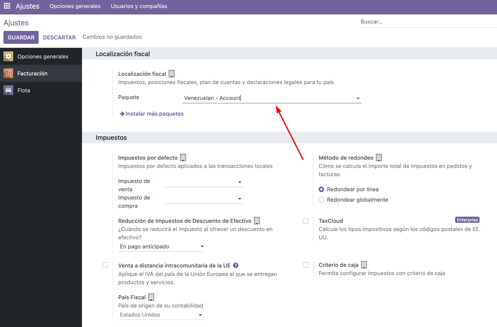
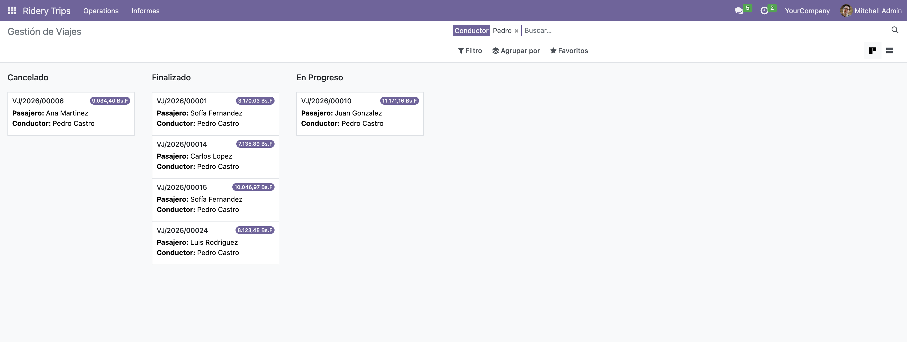
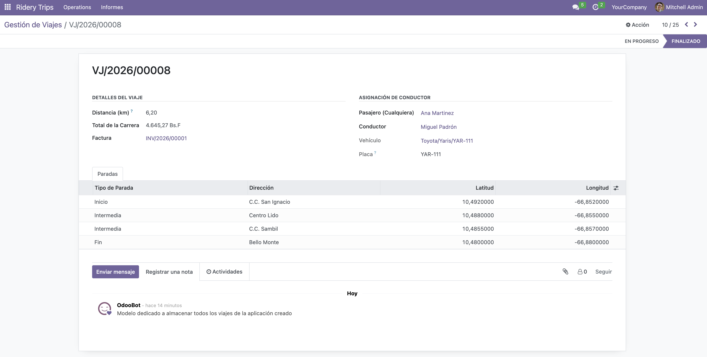

# Prueba Técnica Ridery

> **Descripción:** Este proyecto consiste en un sistema de registro de viajes en **Odoo 16** sincronizado a través de una **API en Node.js**. La arquitectura está completamente dockerizada para facilitar su despliegue y evaluación.

---

## 🛠️ Tecnologías Utilizadas

- **ERP:** Odoo 16 (Python / XML)
- **Base de Datos:** PostgreSQL 15
- **API de Sincronización:** Node.js 20 (Express, TypeScript)
- **Infraestructura:** Docker & Docker Compose

---

## 🚀 Guía de Instalación y Ejecución

El proyecto está configurado para levantarse con un solo comando. Sigue estos pasos:

1. Clona el repositorio y ubícate en la raíz del proyecto.
2. Levanta los contenedores en segundo plano usando Docker Compose:
   ```bash
   docker compose up -d --build
   ```
3. Asegúrate de crear el archivo `.env` con la configuración necesaria expuesta en el archivo `.env.example`.
   > Ejemplo de archivo `.env`:
   ```env
   DB_NAME=odoo
   DB_USER=odoo
   DB_PASSWORD=abc123
   ```
4. Espera un par de minutos a que Odoo instale los módulos y configure la base de datos por primera vez.
5. Ingresa a [http://localhost:8069](http://localhost:8069) e inicia sesión con el usuario `admin` y contraseña `admin`. El contenedor levanta la instancia de Odoo con las credenciales de prueba por defecto y data de demostración para facilitar la evaluación.
6. Al iniciar la base de datos, Docker instalará los módulos: **Ridery** y la extensión de la **Localización Venezolana**.
7. Es necesario ingresar a **Ajustes -> Facturación -> Paquete de Localización** y seleccionar la localización contable venezolana para asegurar de que los diarios y los planes de cuenta se instalen dentro del sistema y que la moneda sea la correcta.

   
---

## 🖥️ Acceso a Odoo

- **URL:** [http://localhost:8069](http://localhost:8069)
- **Usuario por defecto:** `admin`
- **Contraseña por defecto:** `admin`

### ¿Dónde ver los viajes?
1. Inicia sesión en Odoo.
2. Abre la aplicación **Ridery Trips** en el menú principal.
3. Podrás ver el listado de viajes registrados, con su conductor, pasajero, facturación. Todo esto en una vista Kanban.
   
4. Desde la vista form se pueden visualizar mayor lujo de detalles, sin embargo, no se pueden editar los datos, ya que la idea es que los datos provengan desde la API.
   
**Nota importante:** Existe un cron en Odoo que se ejecuta cada 5 minutos para facturar todos los viajes pendientes, aunque se encuentra disponible la opción de facturar manualmente a través del botón solicitado.
---

## 🔌 Uso de la API de Node.js (Sincronización)

La API de Node.js corre en el puerto **3000**. Su función es leer los viajes locales (almacenados en `src/data/trips.json`) y sincronizarlos con Odoo. 

Puedes usar Postman o cURL para interactuar con estos endpoints:

### 1. Sincronizar Viajes (Hacia Odoo)
Lee los viajes pendientes y los envía a Odoo creando la facturación automática.
- **URL:** `http://localhost:3000/api/v1/trips`
- **Método:** `POST`
- **Respuesta Esperada:** 
  ```json
  {
      "ok": true,
      "message": "Sincronización finalizada: 2 exitosos, 0 fallidos.",
      "data": { ... }
  }
  ```

### 2. Ver Viajes Locales
Devuelve la lista actual de viajes que tiene la API local (útil para revisar si ya tienen un `odoo_id` asignado).
- **URL:** `http://localhost:3000/api/v1/trips`
- **Método:** `GET`

### 3. Resetear Data de Prueba
Restablece el archivo `trips.json` a su estado original (borrando las marcas de sincronización) para que puedas probar el flujo de `POST` nuevamente desde cero.
- **URL:** `http://localhost:3000/api/v1/trips/reset-demo`
- **Método:** `POST`

---

## 💡 Flujo de Evaluación Recomendado

1. Levanta los contenedores con `docker compose up -d`.
2. Revisa que Odoo esté funcional en el puerto `8069`.
3. Abre Postman y envía un `POST` a `http://localhost:3000/api/v1/trips`.
4. Ve a Odoo y verifica que los viajes aparezcan en el módulo de Viajes, y revisa que los apuntes contables (facturas) hayan sido generados correctamente en Moneda Nacional (VES).
5. Si deseas volver a probar, usa el endpoint `POST /reset-demo` y repite el proceso.

---

## 👨‍💻 Notas Técnicas sobre la Implementación
- Se configuró la **Moneda VES (Bolívares)** por defecto para la compañía usando archivos XML.
- La comunicación desde Node hacia Odoo usa los controladores web de Odoo (`http.route` con validación mediante API-KEY estática por cabeceras).
- Manejo de Errores: La API procesa transacciones de manera segura, marcando en el archivo JSON cualquier `sync_error` si el viaje falla por validaciones del lado del ERP.
